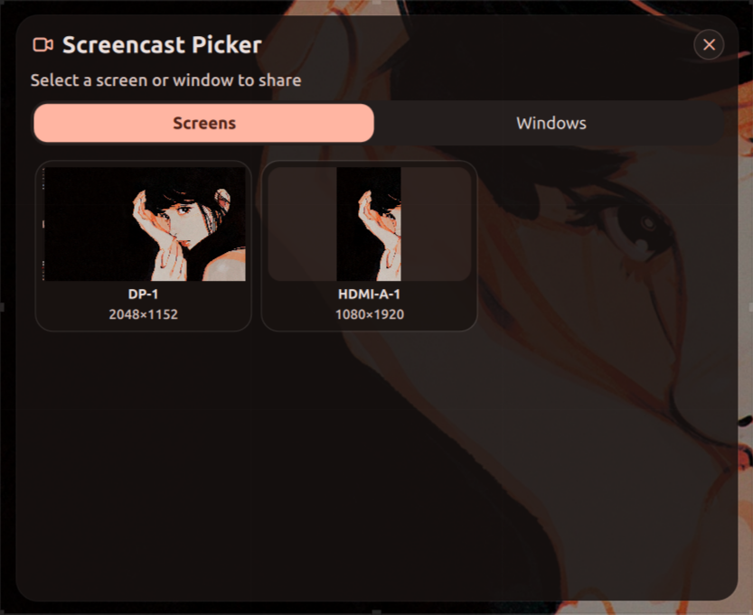

# Screencast Picker

Interactive screen and window picker for Wayland screencast tooling. Select a monitor or window; the chosen source is emitted as an IPC signal so external scripts or tools can start the actual capture.

> This plugin is a **source selector only** — it does not record or stream. Use it with tools like `xdg-desktop-portal`, `wl-screenrec`, `wf-recorder`, `obs-studio`, or your own shell scripts via `noctalia-shell ipc listen`.



## Features

- **Screen list** — all connected monitors with resolution subtitles
- **Window list** — mapped windows (titles, classes) via compositor API
- **Live thumbnails** — `grim`-based previews on Hyprland (screens and all windows, regardless of occlusion or workspace). Works in XDPH mode too by matching window IDs via (class, title).
- **IPC driven** — no bar widget or panel; trigger the picker and receive the result via `noctalia-shell ipc`

## Usage

Trigger the picker:

```sh
noctalia-shell ipc call plugin:screencast-picker showScreensharePicker
```

Listen for the result:

```sh
noctalia-shell ipc listen plugin:screencast-picker popupClosed
```

The result is either `screen:<name>`, `window:<address>`, or `cancelled`.

## Requirements

### Runtime

- `bash` — shell command execution
- `jq` — JSON parsing for window queries
- `hyprctl` — Hyprland compositor queries (Hyprland only)
- `grim` ≥ 1.5.0 — toplevel-export previews via `grim -T` (Hyprland only)
- `niri` — Niri compositor (Niri only; window thumbnails not yet supported on Niri)

### Noctalia Shell

- Noctalia Shell >= 4.4.1
- `Quickshell.Wayland` module (for `PanelWindow` overlay)

## Structure

```
screencast-picker/
├── i18n/
│   └── en.json
├── scripts/
│   └── pick.sh
├── Main.qml
└── manifest.json
```

## IPC Commands

| Command | Description |
|---|---|
| `showScreensharePicker` | Open the picker overlay |

The picker emits `popupClosed(result)` when the user selects a source or cancels.
In normal mode the result is `screen:<name>`, `window:<address>`, or `cancelled`.

### XDPH integration

This plugin can replace Hyprland's default share picker when
`XDPH_WINDOW_SHARING_LIST` is set (automatically detected). Windows are
populated from the env var instead of `hyprctl`, and the output conforms to
the `hyprland-share-picker` format (`[SELECTION]/screen:<name>`/`[SELECTION]/window:<id>`).

The bundled wrapper script `scripts/pick.sh` bridges XDPH → IPC → stdout.
It also forwards the `--allow-token` flag so `allow_token_by_default` in
`xdph.conf` works correctly. If the plugin fails or is unreachable (e.g.
Noctalia Shell not running), the script falls back to
`hyprland-share-picker` directly.

Configure XDPH to use it (adjust the path to your installation):

```ini
# ~/.config/hypr/xdph.conf
screencopy {
  custom_picker_binary = /home/youruser/.config/noctalia/plugins/563115:screencast-picker/scripts/pick.sh
  allow_token_by_default = true
}
```

Restart `xdg-desktop-portal-hyprland`:

```sh
systemctl --user restart xdg-desktop-portal-hyprland
```

## License

MIT
